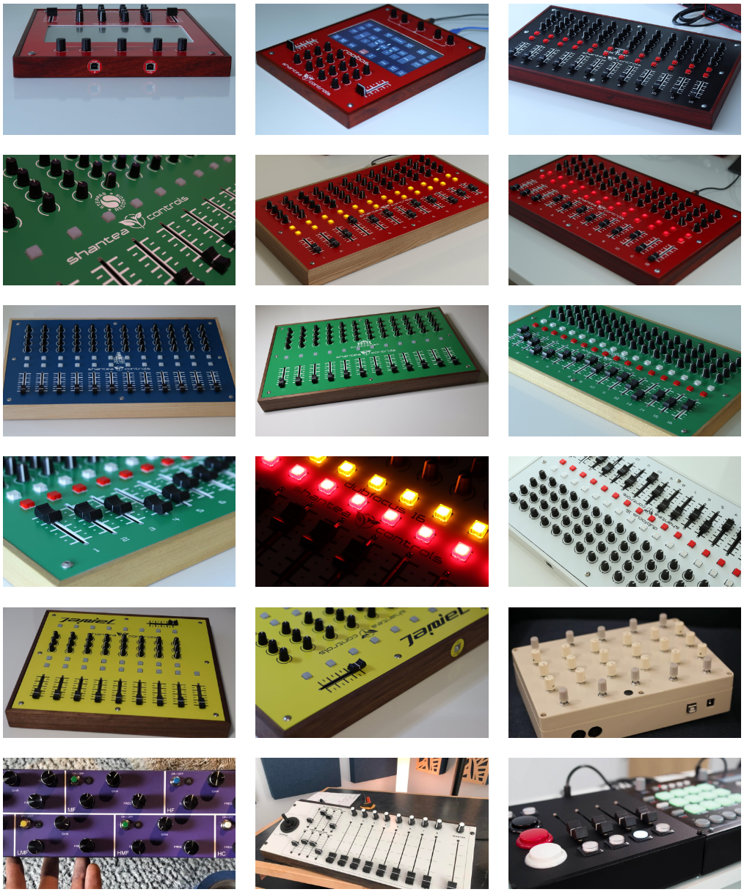

# OpenDeck MIDI Platform

OpenDeck is a platform for building MIDI controllers. It is a firmware running on various boards which transforms them into class-compliant USB MIDI devices, making them compatible with any MIDI software on any operating system. OpenDeck is designed to solve two problems when building a MIDI controller:

* Coding - there is no need to code anything in order to make changes to the controller or to make it work
* Making the controller behave the way you want it to - the firmware supports huge number of configurable parameters, all configurable in a Web browser

Solving this two goals means you can forget about implementation details and focus on having your custom controller built as fast as possible.

The platform also supports DMX output so it can be used as DMX interface through `usbserial` plugin in [Open Lighting Architecture](https://www.openlighting.org/).

*Click the image below for a demo video of the [OpenDeck configurator](https://config.shanteacontrols.com)*

Configurator is available either [online](https://config.shanteacontrols.com) or [offline](https://github.com/shanteacontrols/OpenDeckUI/releases).

*Some of the controllers built with OpenDeck*

## Features

The following components are supported:

* Buttons
* Encoders
* LEDs (single color or RGB)
* Potentiometers
* FSRs (force-sensitive resistors)
* LCD/OLED displays
* Touchscreen displays (Nextion and Viewtech/Stone)

OpenDeck supports sending of both 7-bit and 14-bit Non-Registered Part Numbers (NRPN), latching messages on buttons, various encoding modes for quadrature encoders, LED control using MIDI In, configurable MIDI channels for each component individually, DMX output etc. Full list of supported features can be found [here](https://github.com/shanteacontrols/OpenDeck/wiki/Configurable-features).

If the feature you want isn't supported yet, don't feel discouraged. Open up a [discussion thread](https://github.com/shanteacontrols/OpenDeck/discussions) and let's talk about it.

## Supported boards

OpenDeck firmware is compatible with [official OpenDeck board](https://www.tindie.com/products/paradajz/opendeck-diy-midi-platform/), as well as various other boards, both small and large:

* [Arduino Mega2560](https://store.arduino.cc/products/arduino-mega-2560-rev3)
* [Arduino Mega2560 Pro Mini / Meduino](http://wiki.epalsite.com/index.php?title=Mega2560_Pro_Mini)
* [Mux Shield v2 with Arduino Mega2560](https://mayhewlabs.com/products/mux-shield-2)
* [Teensy++ 2.0](https://www.pjrc.com/store/teensypp.html)
* [STM32F4 Discovery](https://www.st.com/en/evaluation-tools/stm32f4discovery.html) ([Mouser](https://hr.mouser.com/ProductDetail/STMicroelectronics/STM32F407G-DISC1?qs=%2Fha2pyFadugMvYxi1ftRWf5mGCRgIpVnZzkmnZLph%2FPbqHgeIRafES4CiZOiJh1y) / [Digikey](https://www.digikey.com/en/products/detail/stmicroelectronics/STM32F407G-DISC1/5824404?s=N4IgTCBcDaIMoBUCyBmMAxALABgOwHEBaAEQEk4BhARhAF0BfIA))
* [STM32F401CC Black Pill](https://stm32-base.org/boards/STM32F401CCU6-WeAct-Black-Pill-V1.2.html)
* [STM32F401CE Black Pill](https://stm32-base.org/boards/STM32F401CEU6-WeAct-Black-Pill-V3.0)
* [STM32F411 Black Pill](https://stm32-base.org/boards/STM32F411CEU6-WeAct-Black-Pill-V2.0) ([Adafruit](https://www.adafruit.com/product/4877) / [AliExpress](https://www.aliexpress.com/item/1005001456186625.html?pdp_ext_f=%7B%22sku_id%22:%2212000016817645221%22,%22ship_from%22:%22CN%22%7D&gps-id=pcStoreJustForYou&scm=1007.23125.137358.0&scm_id=1007.23125.137358.0&scm-url=1007.23125.137358.0&pvid=c145b0d6-10a9-42f7-9ddf-a3701e2ee9a1&spm=a2g0o.store_pc_home.smartJustForYou_6000147819213.1))
* [Waveshare Core405R](https://www.waveshare.com/core405r.htm)
* [Waveshare Core407V](https://www.waveshare.com/core407v.htm)
* [Waveshare Core407I](https://www.waveshare.com/core407i.htm)
* [STM32F4VE](https://stm32-base.org/boards/STM32F407VET6-STM32-F4VE-V2.0) ([eBay](https://www.ebay.com/itm/401956886691?hash=item5d967f58a3:g:fFcAAOSw4fhdy2rk))
* [TPyBoard (PyBoard clone)](http://www.chinalctech.com/m/view.php?aid=338) ([eBay](https://www.ebay.com/itm/183887614794?hash=item2ad08e534a:g:bmsAAOSwrSpdLtFM))
* [nRF52840 DK](https://www.nordicsemi.com/Products/Development-hardware/nrf52840-dk)

*Some of the supported boards*

For more details on supported boards, check the dedicated [wiki page](https://github.com/shanteacontrols/OpenDeck/wiki/Connecting-components-to-OpenDeck). A page with [instructions on how to flash OpenDeck firmware](https://github.com/shanteacontrols/OpenDeck/wiki/Flashing-the-OpenDeck-firmware) to supported boards is also available. Support for custom boards can be easily added using [YAML descriptors](https://github.com/shanteacontrols/OpenDeck/wiki/Creating-custom-board-variant).

## Documentation

Available on dedicated [Wiki section](https://github.com/shanteacontrols/OpenDeck/wiki/).

## Discussion

Need help? Want to show off your OpenDeck based builds? Head over to [Discussions](https://github.com/shanteacontrols/OpenDeck/discussions)!

## Credits

* Hardware MIDI source code based on [Arduino MIDI library v4.2](https://github.com/FortySevenEffects/arduino_midi_library/releases/tag/4.2) by Francois Best.
* USB MIDI source code based on [LUFA USB framework](http://www.fourwalledcubicle.com/LUFA.php) by Dean Camera.

## Licence

Most of the code is available under Apache Licence v2.0, with the following exceptions:

* `modules`:
  * `avr-libstdcpp`: GNU GPL v3 or later with GCC Runtime Library Exception 3.1
  * `core`: MIT
  * `dbms`: MIT
  * `dmxusb`: MIT
  * `EmuEEPROM`: MIT
  * `lufa`: Modified MIT, see `modules/lufa/LUFA/Licence.txt` for details
  * `midi`: MIT
  * `sysex`: MIT
  * `u8g2`: Two-clause BSD
  * `unity`: MIT
  * `tinyusb`: MIT, but many modules it uses are individually licenced, check for more details